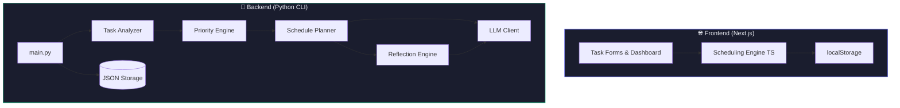

<div align="center">

# ⚡ AutoSched

### AI-Powered Autonomous Task Scheduler & Productivity Agent

[](https://python.org)
[](https://nextjs.org)
[](https://typescriptlang.org)
[](https://vercel.com)
[](LICENSE)

An autonomous productivity agent that **observes** your tasks, **reasons** about urgency and effort, **generates** optimal daily schedules, and **learns** from your patterns over time.

---

</div>

## ✨ Features

| Feature | Description |
|---------|-------------|
| 🧠 **AI-Powered Scheduling** | Prioritizes tasks using importance, deadline urgency, and effort estimation |
| 📊 **Smart Priority Engine** | Composite scoring with importance weighting, urgency decay, and size penalties |
| 📅 **Daily Plan Generation** | Time-blocked schedule that fits within your configured work window |
| 🔄 **Reflection & Learning** | Post-execution analysis that updates estimation bias and capacity over time |
| 🌙 **Dark / Light Mode** | Professional UI with glassmorphism, smooth animations, and theme toggle |
| 📋 **Beautiful Task Forms** | Rich input forms with star ratings, tag chips, datetime pickers, and smart placeholders |
| 💾 **Persistent Memory** | Backend uses JSON files; Frontend uses localStorage — both remember your history |
| 🚀 **Vercel-Ready** | Next.js frontend deploys to Vercel in one click |

---

## 🏗️ Architecture



### Agent Loop

The backend implements a full **autonomous agent loop**:

```
OBSERVE → ANALYZE → REASON → PLAN → ACT → REFLECT → REMEMBER
   ↑                                                      |
   └──────────────── Learning Feedback Loop ──────────────┘
```

1. **Observe** — Load tasks from `inputs/tasks.json` and past behavior from `memory/user_history.json`
2. **Analyze** — Normalize fields, estimate effort using heuristics + bias correction
3. **Reason** — Score tasks using a composite priority formula (importance × urgency − size penalty)
4. **Plan** — Generate time-blocked daily schedule via greedy scheduling + LLM rationale
5. **Act** — Simulate task execution (replaceable with real integrations)
6. **Reflect** — Compute completion rate, extract insights, suggest adjustments
7. **Remember** — Persist updated preferences and run history for future improvement

---

## 📁 Project Structure

```
AutoSched/
├── backend/                    # 🐍 Python CLI Agent
│   ├── agent/
│   │   ├── task_analyzer.py    # Task normalization & effort estimation
│   │   ├── priority_engine.py  # Composite priority scoring
│   │   ├── schedule_planner.py # Time-blocked schedule generation
│   │   └── reflection_engine.py# Post-execution learning
│   ├── llm/
│   │   └── llm_client.py       # LLM abstraction (mock / real)
│   ├── utils/
│   │   └── helpers.py          # JSON I/O, datetime utils
│   ├── inputs/
│   │   └── tasks.json          # Task definitions
│   ├── memory/
│   │   └── user_history.json   # Persistent agent memory
│   ├── main.py                 # Entry point
│   └── requirements.txt        # Dependencies
│
├── frontend/                   # ⚡ Next.js Web App
│   ├── src/
│   │   ├── app/
│   │   │   ├── layout.tsx      # Root layout + SEO
│   │   │   ├── page.tsx        # Main app page
│   │   │   └── globals.css     # Design system
│   │   ├── components/
│   │   │   ├── TaskForm.tsx    # Task creation/editing form
│   │   │   ├── TaskList.tsx    # Task dashboard with cards
│   │   │   └── ScheduleView.tsx# Schedule timeline view
│   │   └── lib/
│   │       ├── types.ts        # Shared TypeScript interfaces
│   │       ├── scheduler.ts    # Client-side scheduling engine
│   │       └── storage.ts      # localStorage persistence
│   ├── package.json
│   └── tsconfig.json
│
├── README.md
└── .gitignore
```

---

## 🚀 Getting Started

### Prerequisites

- **Python 3.10+** (for the backend CLI)
- **Node.js 18+** (for the frontend)

### Backend (Python CLI)

```bash
# Run the autonomous agent
python3 backend/main.py
```

The CLI agent will:
- Load your tasks from `backend/inputs/tasks.json`
- Generate an optimized daily schedule
- Simulate execution and reflect on results
- Update memory in `backend/memory/user_history.json`

### Frontend (Next.js)

```bash
# Install dependencies
cd frontend && npm install

# Start development server
npm run dev
```

Open [http://localhost:3000](http://localhost:3000) to see the app.

### Deploy to Vercel

```bash
# Option 1: Vercel CLI
cd frontend
npx vercel

# Option 2: Connect GitHub repo to Vercel Dashboard
# Set root directory to "frontend" in Vercel project settings
```

---

## 🎨 UI Highlights

- **Task Forms** — Clean input fields with descriptive placeholders, ★ star rating for importance, clickable tag chips, and datetime pickers
- **Task Dashboard** — Cards with color-coded priority borders, deadline countdowns, status badges, and hover-reveal actions
- **Schedule View** — Summary stats, time-blocked timeline, postponed section, and AI rationale display
- **Theme Toggle** — Smooth dark ↔ light mode transition with persistent preference
- **Glassmorphism** — Frosted glass header with backdrop blur and subtle depth
- **Micro-animations** — Fade-in cards, hover lifts, toast notifications

---

## ⚙️ How the Scheduler Works

### Priority Score Formula

```
priority = 0.6 × (importance / 5)
         + 0.5 × urgency_score
         − 0.3 × size_penalty
```

| Component | Logic |
|-----------|-------|
| **Importance** | Normalized from 1–5 scale → 0.2–1.0 |
| **Urgency** | `1 / (1 + days_until_deadline)` — exponential decay, overdue = 1.0 |
| **Size Penalty** | `min(0.3, log1p(est_minutes) / 10)` — large tasks slightly deprioritized |

### Estimation Bias

The agent tracks how accurate your time estimates are. If you consistently underestimate:
- `estimation_bias` increases (e.g., 1.0 → 1.11)
- Future estimates are automatically inflated
- The bias is bounded between 0.7× and 1.5×

---

## 🛠️ Tech Stack

| Layer | Technology | Purpose |
|-------|-----------|---------|
| **Frontend** | Next.js 16, TypeScript, Vanilla CSS | Web UI with SSG |
| **Backend** | Python 3.10+ | Autonomous CLI agent |
| **LLM** | Mock client (swappable) | Planning rationale & reflection |
| **Storage** | localStorage / JSON files | Persistent state |
| **Deployment** | Vercel | Frontend hosting |

---

## 📝 Customization

### Editing Tasks (Backend)

Edit `backend/inputs/tasks.json`:

```json
{
  "tasks": [
    {
      "id": "T1",
      "title": "Your task title",
      "description": "What needs to be done",
      "estimated_minutes": 90,
      "deadline": "2026-02-01T18:00:00",
      "importance": 4,
      "tags": ["coding", "project"],
      "status": "pending"
    }
  ]
}
```

### Work Preferences

Edit `backend/memory/user_history.json` → `preferences`:

```json
{
  "preferences": {
    "work_start": "09:00",
    "work_end": "17:00",
    "daily_capacity_hours": 8,
    "estimation_bias": 1.0
  }
}
```

### Connecting a Real LLM

Replace the mock client in `backend/llm/llm_client.py`:

```python
class LLMClient:
    def __init__(self, mock_mode=False):
        self.mock_mode = mock_mode

    def call(self, prompt, context=None):
        if self.mock_mode:
            return self._mock_response(prompt, context)
        # Add your OpenAI / Gemini / Claude call here
        response = openai.chat.completions.create(...)
        return response.choices[0].message.content
```

---

## 🤝 Contributing

1. Fork the repository
2. Create a feature branch (`git checkout -b feat/amazing-feature`)
3. Commit your changes (`git commit -m 'feat: add amazing feature'`)
4. Push to the branch (`git push origin feat/amazing-feature`)
5. Open a Pull Request

---

## 📄 License

This project is open source and available under the [MIT License](LICENSE).

---

<div align="center">

**Built with ❤️ by [Yuvraj](https://github.com/yuvieee01)**

*Star ⭐ this repo if you found it useful!*

</div>
